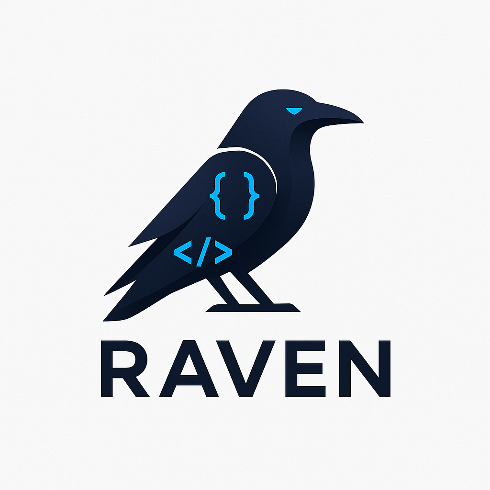

<p align="center">
  
</p>

<p align="center">
  A modern programming language built with Rust.<br/>
  Fast, safe, expressive, and easy to read.
</p>

<p align="center">
  <a href="https://github.com/martian56/raven/actions/workflows/ci.yml"></a>
  <a href="https://github.com/martian56/raven/releases"></a>
  <a href="https://github.com/martian56/raven/blob/main/LICENSE"></a>
  <a href="https://marketplace.visualstudio.com/items?itemName=martian56.raven-language"></a>
</p>

<p align="center">
  <a href="https://martian56.github.io/raven/">Documentation</a>
  ·
  <a href="https://raven.ufazien.com/">Website</a>
  ·
  <a href="https://github.com/martian56/raven/releases">Releases</a>
  ·
  <a href="https://github.com/martian56/raven/issues">Issues</a>
</p>

## Why Raven

- Fast runtime and modern tooling built in Rust.
- Clean syntax with static typing.
- Structs, enums, modules, and rich standard library.
- CLI and REPL workflow for quick iteration.
- VS Code extension for syntax and developer ergonomics.

## Quick Example

```rust
struct User {
    name: string,
    age: int
}

fun greet(user: User) -> void {
    print(format("Hello {}, you are {}!", user.name, user.age));
}

let u: User = User { name: "Raven", age: 1 };
greet(u);
```

## Quick Start

```bash
# Build from source
git clone https://github.com/martian56/raven.git
cd raven
cargo build --release

# Run a file
./target/release/raven hello.rv

# REPL
./target/release/raven
```
Or get the installer for your OS from the [releases](https://github.com/martian56/raven/releases) page.

## Learn More

- Full docs: [https://martian56.github.io/raven/](https://martian56.github.io/raven/)
- Project website: [https://raven.ufazien.com/](https://raven.ufazien.com/)
- Standard library overview: [https://martian56.github.io/raven/standard-library/overview/](https://martian56.github.io/raven/standard-library/overview/)
- Examples: [https://martian56.github.io/raven/examples/basic/](https://martian56.github.io/raven/examples/basic/)

## Technologies Used

<p>
  <a href="https://www.rust-lang.org/"></a>
  <a href="https://www.typescriptlang.org/"></a>
  <a href="https://github.com/features/actions"></a>
  <a href="https://www.docker.com/"></a>
</p>

## Star History

<a href="https://www.star-history.com/?repos=martian56%2Fraven&type=date&legend=top-left">
 <picture>
   <source media="(prefers-color-scheme: dark)" srcset="https://api.star-history.com/image?repos=martian56/raven&type=date&theme=dark&legend=top-left" />
   <source media="(prefers-color-scheme: light)" srcset="https://api.star-history.com/image?repos=martian56/raven&type=date&legend=top-left" />
   
 </picture>
</a>

## Repo Activity


## Contributors

<a href="https://github.com/martian56/raven/graphs/contributors">
  
</a>

## Community

- Contributing guide: [CONTRIBUTING.md](./CONTRIBUTING.md)
- Code of conduct: [CODE_OF_CONDUCT.md](./CODE_OF_CONDUCT.md)
- Security policy: [SECURITY.md](./SECURITY.md)

## License

MIT License. See [LICENSE](./LICENSE).
